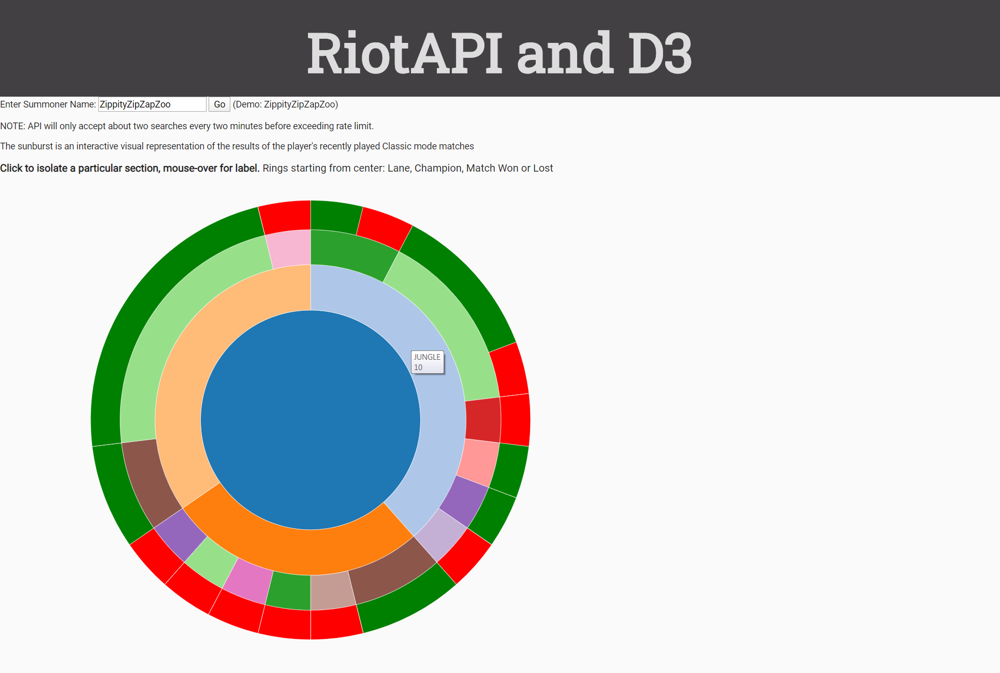

# RiotAPI with D3

Web App that takes a League of Legends summoner name and displays a sunburst as an interactive visual representation of the results of the player's recently-played matches. Accepts two searches every two minutes before exceeding rate limits.

